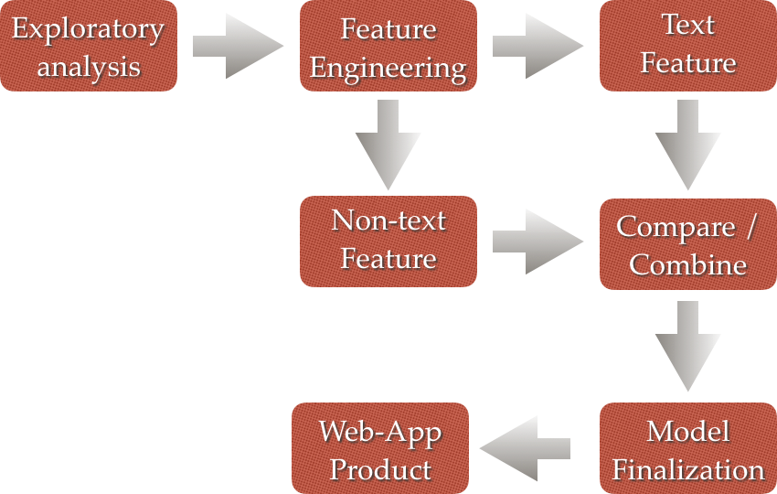
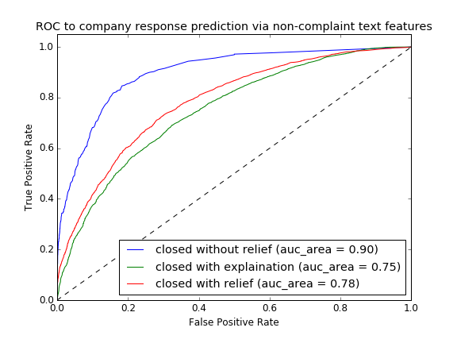
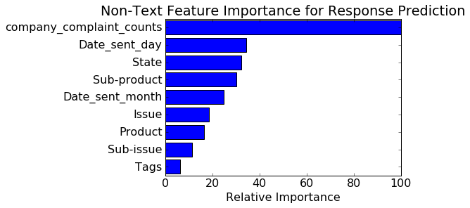
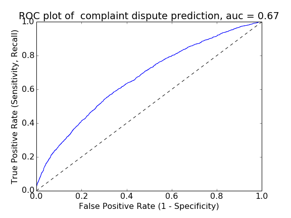

# Financial Service Complaint Management

## Introduction
Receiving a complaint from a consumer happens everyday in the world of business. While nobody likes complaints, an consumer’s complaint present business with an opportunity to identify and rectify specific problems with your current product or service. They can also help you to develop your relationship with your customer by allowing you to demonstrate that you value them by taking their concerns seriously and dealing with their complaint. Service complaints management is a critical part of business management. A good complaint-management strategy will result in best customer relationship outcome with minimal human-resource investment. On the other hand, consumers usually have a hard time understanding company’s complaint process, and end up disputing with response outcome.  Lack of understanding between business and consumers will certainly result in reduced efficiency of the total complaining process.

## Objective
This project has developed a machine learning algorithm model via public financial service complaint data to provide insight about complaint management in financial service. The complaining is a two-way process involving consumer’s submission, business response, and consumer’s decision to accept or dispute the response. The developed model provides benefits in both directions. In another word, two models were developed in this project. One aims to predict customer dispute probability from the point of business for better customer service management, and the other model provides company’s response prediction from the point of individual consumer. As far as I know, this is the first time that the machine learning algorithm was applied in the field of complaint management. The similar concept may be implemented in other types of service complaint management in the future.

## Data
The data were collected by “Consumer Financial Protection Bureau” (http://www.consumerfinance.gov/). The data file collects 537,992 financial product user complaints from year of 2011 to 2015. A little over 10% of the users (59,697) provided complaint text narrative under agreement consent after filtering personal information from the text. The data list final business response and dispute outcome of customer that were used as the labels during the model establishment.

## Model Development Pipeline
The overall pipeline of model development was carried out in the following steps, as described in the flowchart figure:
Exploratory data analysis was performed by plotting different categorical variables against expected label values, and missing data were replaced by “not provided” or “unknown” string values. Some missing values of “State” information were filled using “zip code” values. The date variables were converted into python time series format.
“Dispute predication model" labels were directly created by converting variable “Consumer disputed?” string value into binary boolean values. The labels for “Company response to consumer” model were created into three categorical values (0,1,2) corresponding to “Closed without relief”, “Closed with explanation” and ‘Closed with relief”, respectively. In addition to feature variables available by the original dataset, some other new features, for example, “process time”, “complaint counts of company” et al. were engineered by deducting values from current variable values.
Model was optimized by cross-validating split training and test data.
The model were firstly carried out by feature engineering of all category variables in the dataset except complaints narrative text. Logistic, Random Forest, and Stochastic Gradient Classifier were implemented for the dispute prediction modeling. One versus rest Naive Bayes classifier and Random Forest classifier were implemented to develop the company response prediction model.
As for features extracted from complaint narrative text, the tf-idf vectorized matrix were built and the resulting matrix were subject to Naive Bayes classifier modeling or a SVD or PCA dimension reduction were performed followed by Random Forest or Stochastic Gradient Decent classifier modeling.
The model parameter tuning were performed by GridCV Search over a EC2 machine over Amazon Web Service (AWS), and the best performance model were used in the final result.

## Results
1. Company Response Prediction Model were developed by normalized non-text features using Random Forest Classifier, and the model performance were evaluated by one vs.rest classifier ROC curve in the following figure. The AUC area of three types (“closed without relief”, “closed with explanation”, and “closed with relief”) of prediction has a value of 0.89, 0.75 and 0.78, respectively. The feature importance plot has demonstrated relative extent of contribution from non-text variables in the model. it seems the number of the complaints a company has received (that is related to the company size) becomes the most important feature in this response prediction model. Other features such as the day, the month and the service product of the complaint submitted to the company also contribute significantly to the model prediction value.

2. Consumer Dispute Prediction has demonstrated a great challenge in the initial model. The model developed from non-text features only demonstrated an AUC value of 0.57. Next a new dispute prediction model were developed using features extracted from “Complaint narrative text”. The complaint text were subject to TF-IDF vectorization process, after NLTK stop_words removal. The capital X character used to replace the personal information in the text were removed before vectorization. A Stochastic Gradient Decent classifier with a loss function of logistic were established using vectorized feature matrix. The resulting AUC value was resulted as 0.67, which is a great improvement relative to the model using non-text feature.

## Future work
1. Other machine learning algorithm (i.e. Word2Vector) or sentiment analysis for the text my be used to boost the performance of the current model.
2. Discover business dispute cost to establish profit confusion matrix for current model.
3. Implement similar model concept to other types of complaint management
